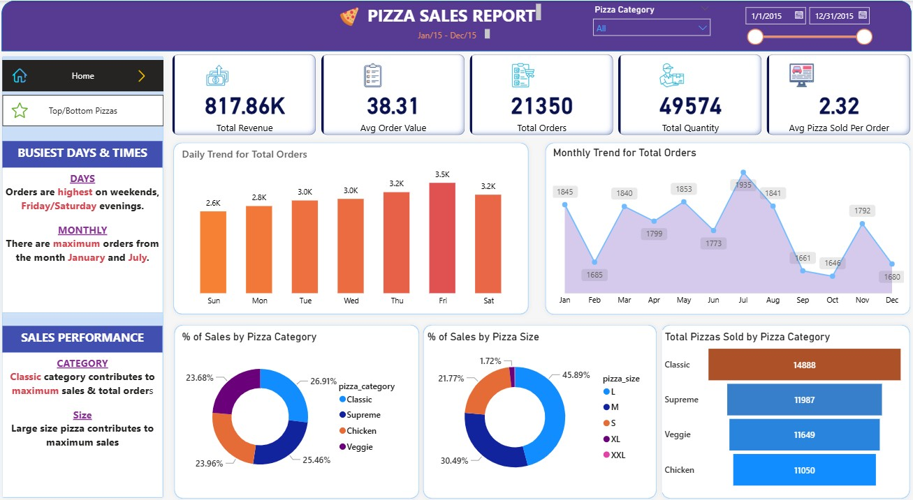
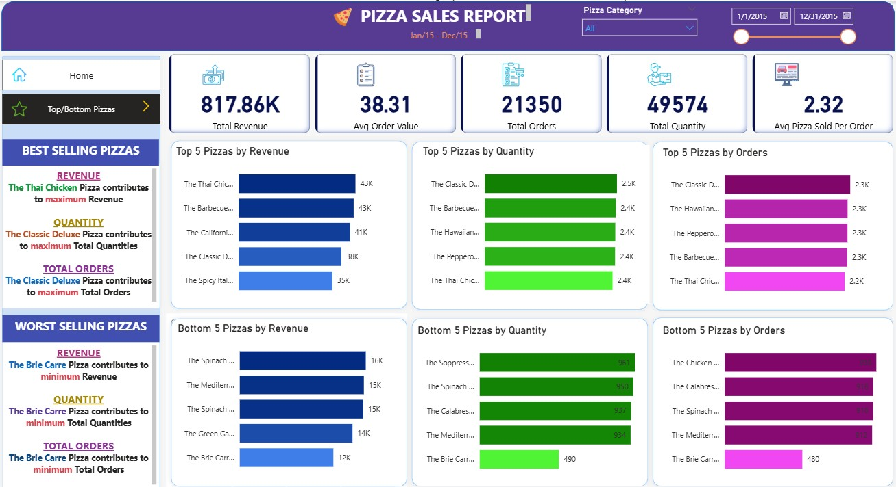

# 🍕 Pizza Sales Analysis Dashboard (Power BI)
## 📋 Project Overview

This Power BI dashboard analyzes pizza sales performance for a restaurant chain over the year 2015.
It provides key business insights on sales revenue, order trends, product performance, and customer preferences to support data-driven decisions.

## 🎯 Objectives

- Track total revenue, average order value, total orders, and quantity sold.
- Identify busiest days and months for pizza orders.
- Analyze sales distribution by pizza category and pizza size.
- Highlight top and bottom performing pizzas by revenue, quantity, and order volume.

---

## 📊 Dashboard Insights
### 🏠 Home Page
- Visualizes daily and monthly trends for total orders.
- Shows sales breakdown by category and size.
- Identifies busiest days/times and highest-performing pizza categories.

### 🍕 Top/Bottom Pizzas Page
- Displays best-selling and least-selling pizzas based on revenue, quantity, and total orders.
- Helps identify underperforming items and potential improvement opportunities.

## 🧰 Tools & Technologies
- Microsoft Power BI for dashboard design and visualization
- Excel Dataset as data source
- DAX for calculated metrics (e.g., KPIs and averages)

## 📷 Dashboard Preview

**Home Page**  

**Top/Bottom Pizzas Page**  

